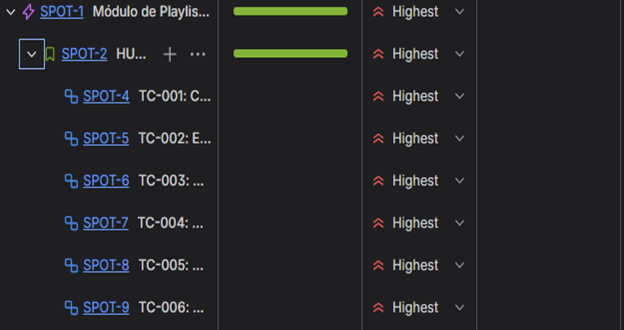
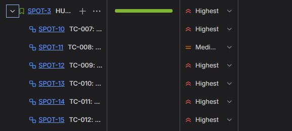
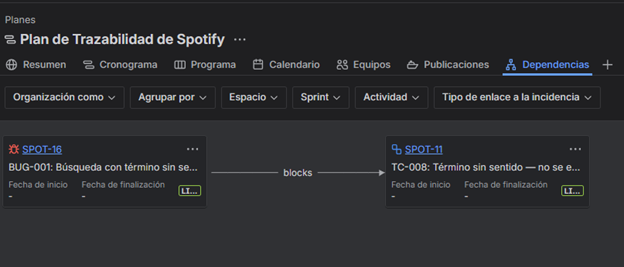
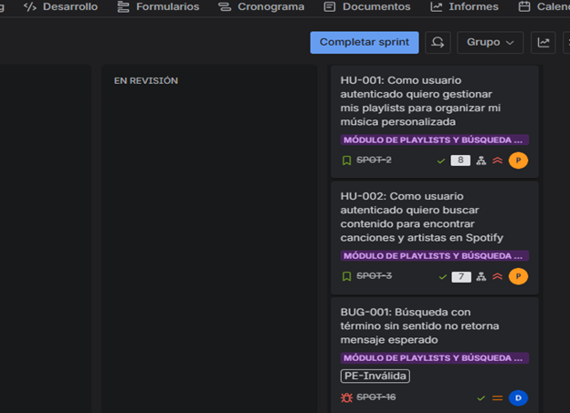

# 🎵 Lab 04 — Trazabilidad entre Requisitos y Pruebas | Spotify Platform

> **IS-489 · Pruebas y Aseguramiento de Calidad de Software**
> Universidad Nacional de San Cristóbal de Huamanga — Semestre 2026-I

---

## 1. Portada

| Campo | Detalle |
|---|---|
| **Universidad** | Universidad Nacional de San Cristóbal de Huamanga (UNSCH) |
| **Facultad** | Ingeniería de Minas, Geología y Civil |
| **Escuela Profesional** | Ingeniería de Sistemas |
| **Asignatura** | IS-489 Pruebas y Aseguramiento de Calidad de Software |
| **Docente** | Ing. Lizbeth Jaico Quispe |
| **Semestre Académico** | 2026-I · Presencial |
| **Laboratorio** | Guía 04 — Trazabilidad entre Requisitos y Pruebas |
| **Alumno** | Aguilar Flores, Crisólogo |
| **Serie** | 400 |
| **Sistema bajo prueba** | Spotify — Reproductor Web |
| **URL del sistema** | [https://open.spotify.com](https://open.spotify.com) |
| **Fecha de entrega** | 25 de mayo de 2026 |
| **Sede** | Ayacucho, Perú |

---

## 2. Descripción del Sistema

**Spotify** es una plataforma global de streaming de música, pódcasts y videos digitales que permite a millones de usuarios acceder a un catálogo de más de 100 millones de pistas desde cualquier dispositivo. Para este laboratorio se trabaja sobre el **reproductor web** en `open.spotify.com`.

| Perfil | Características |
|---|---|
| **Usuario Free** | Acceso con publicidad, funcionalidades básicas |
| **Usuario Premium** | Alta fidelidad, descarga offline, sin anuncios |
| **Creador / Admin** | Gestión de contenido y analíticas |

---

## 3. Módulos Elegidos y Justificación

Se seleccionaron dos módulos del reproductor web que permiten evidenciar las **4 técnicas de diseño de pruebas funcionales** exigidas por la cátedra:

### Módulo 1 — Gestión de Playlists (Creación y Edición)
Permite crear y editar colecciones personalizadas de audio. Restricciones documentadas: nombre máximo **100 caracteres**, descripción máxima **300 caracteres**. Ante nombre vacío muestra el mensaje *"El nombre de la lista de reproducción es obligatorio"*.

### Módulo 2 — Búsqueda y Filtrado (Search)
Motor de búsqueda en tiempo real (*as-you-type*) con fuzzy matching, gestión de entradas vacías, cadenas excesivas y sanitización de inyecciones XSS/SQL.

---

## 4. Historias de Usuario y Criterios de Aceptación

### HU-001 — Gestión de Playlists
> *Como usuario autenticado quiero gestionar mis playlists para organizar mi música personalizada.*

| CA | Criterio de Aceptación | TC | Técnica |
|:---:|---|:---:|:---:|
| CA-1 | Nombre y descripción válidos → playlist creada correctamente | TC-001 | PE-Válida |
| CA-2 | Edición de nombre/descripción → cambios reflejados de inmediato | TC-002 | PE-Válida |
| CA-3 | Nombre exactamente 100 chars (AVL-N) → acepta sin truncar | TC-004 | AVL |
| CA-4 | Nombre 101 chars (AVL-N+1) → trunca silenciosamente a 100 | TC-005 | AVL |
| CA-5 | Descripción supera 300 chars → campo bloquea carácter 301 | TC-003 | PE-Inválida |
| CA-6 | Nombre vacío → mensaje de error obligatorio | TC-006 | Edge Case |

### HU-002 — Búsqueda y Filtrado
> *Como usuario autenticado quiero buscar contenido para encontrar canciones y artistas en Spotify.*

| CA | Criterio de Aceptación | TC | Técnica |
|:---:|---|:---:|:---:|
| CA-7 | Término válido → artista como "El resultado más relevante" | TC-007 | PE-Válida |
| CA-8 | Término inexistente → "No se encontraron resultados" | TC-008 | PE-Inválida |
| CA-9 | Término regional específico → fuzzy match o cero resultados | TC-009 | PE-Inválida |
| CA-10 | Cadena 800+ chars → trunca o devuelve cero resultados sin errores | TC-010 | PE-Inválida |
| CA-11 | Campo vacío/espacios → mantiene pantalla de categorías | TC-011 | Edge Case |
| CA-12 | XSS + SQL injection → cadenas sanitizadas como texto plano | TC-012 | Edge Case |

---

## 5. Matriz de Trazabilidad RTM

📊 **[Ver Matriz Completa en Google Sheets](https://docs.google.com/spreadsheets/d/1Iem8TyL2lNa3CMR_tcQIjFss-JYq_TrG/edit?gid=630855994#gid=630855994)**

### Resumen de trazabilidad QA

| ID | Módulo | Nombre del Escenario | Técnica | Prioridad | Resultado Esperado | Estado |
|:---:|:---:|---|:---:|:---:|---|:---:|
| TC-001 | Playlists | Creación exitosa de playlist con datos válidos | PE-Válida | 🔴 Alta | Playlist creada en "Tu biblioteca" con nombre y descripción | ✅ PASS |
| TC-002 | Playlists | Edición exitosa de nombre y descripción | PE-Válida | 🔴 Alta | Cambios reflejados de forma inmediata en la interfaz | ✅ PASS |
| TC-003 | Playlists | Descripción supera 300 chars — trunca a límite | PE-Inválida | 🔴 Alta | Campo trunca silenciosamente a 300 chars sin error | ✅ PASS |
| TC-004 | Playlists | Nombre exactamente 100 chars — AVL N | AVL | 🔴 Alta | Playlist creada con nombre completo de 100 caracteres | ✅ PASS |
| TC-005 | Playlists | Nombre 101 chars bloqueado — AVL N+1 | AVL | 🔴 Alta | Campo bloquea carácter 101, nombre truncado a 100 | ✅ PASS |
| TC-006 | Playlists | Nombre vacío genera mensaje de error obligatorio | Edge Case | 🔴 Alta | Mensaje "El nombre de la lista de reproducción es obligatorio" | ✅ PASS |
| TC-007 | Búsqueda | Búsqueda válida "Dua Lipa" — resultado correcto | PE-Válida | 🔴 Alta | Artista mostrado como "El resultado más relevante" | ✅ PASS |
| TC-008 | Búsqueda | Término sin sentido — no se encontraron resultados | PE-Inválida | 🟡 Media | Mensaje "No se encontraron resultados de xkqz..." | ❌ FAIL |
| TC-009 | Búsqueda | Término regional "Vinchos Ayacucho" — fuzzy match | PE-Inválida | 🔴 Alta | Resultados aproximados o mensaje cero resultados | ✅ PASS |
| TC-010 | Búsqueda | Cadena 800+ chars excesiva | PE-Inválida | 🔴 Alta | Cadena truncada o cero resultados sin errores de app | ✅ PASS |
| TC-011 | Búsqueda | Campo vacío / solo espacios en blanco | Edge Case | 🔴 Alta | Mantiene pantalla de categorías sin procesar búsqueda | ✅ PASS |
| TC-012 | Búsqueda | XSS + SQL injection sanitizado | Edge Case | 🔴 Alta | Cadenas escapadas como texto plano sin ejecutar código | ✅ PASS |

### Distribución por técnica de diseño

| Técnica | Cantidad | IDs | Mínimo requerido | ¿Cumple? |
|---|:---:|---|:---:|:---:|
| PE — Clase Válida | 3 | TC-001, TC-002, TC-007 | 2 | ✅ |
| PE — Clase Inválida | 4 | TC-003, TC-008, TC-009, TC-010 | 4 | ✅ |
| Análisis de Valores Límite (AVL) | 2 | TC-004, TC-005 | 2 | ✅ |
| Edge Cases | 3 | TC-006, TC-011, TC-012 | 2 | ✅ |
| **Total** | **12** | | **10** | ✅ |

### GAPs detectados

> **Resultado: 0 GAPs** — Cobertura de trazabilidad del **100%**. Cada Criterio de Aceptación tiene exactamente un Caso de Prueba que lo verifica, y cada Caso de Prueba responde a un requisito documentado.

---

## 6. Estructura en Jira Software

**Proyecto:** `Spotify-QA` · **Clave:** `SPOT` · **Tipo:** Scrum

```
EPIC: Módulo de Playlists y Búsqueda — Spotify Web
 │
 ├── STORY: HU-001 — Gestión de Playlists
 │    ├── SUB-TASK: TC-001 — Creación exitosa de playlist          → ✅ PASS
 │    ├── SUB-TASK: TC-002 — Edición exitosa nombre/descripción    → ✅ PASS
 │    ├── SUB-TASK: TC-003 — Descripción supera 300 chars          → ✅ PASS
 │    ├── SUB-TASK: TC-004 — Nombre 100 chars (AVL-N)              → ✅ PASS
 │    ├── SUB-TASK: TC-005 — Nombre 101 chars (AVL-N+1)            → ✅ PASS
 │    └── SUB-TASK: TC-006 — Nombre vacío → error obligatorio      → ✅ PASS
 │
 ├── STORY: HU-002 — Búsqueda y Filtrado
 │    ├── SUB-TASK: TC-007 — Búsqueda válida "Dua Lipa"            → ✅ PASS
 │    ├── SUB-TASK: TC-008 — Término sin sentido                   → ❌ FAIL
 │    ├── SUB-TASK: TC-009 — Término regional "Vinchos Ayacucho"   → ✅ PASS
 │    ├── SUB-TASK: TC-010 — Cadena 800+ chars excesiva            → ✅ PASS
 │    ├── SUB-TASK: TC-011 — Campo vacío / solo espacios           → ✅ PASS
 │    └── SUB-TASK: TC-012 — XSS + SQL injection                  → ✅ PASS
 │
 └── BUG: BUG-001 — Término sin sentido no retorna mensaje esperado
          └── is blocked by → TC-008
```

---

## 7. Informe Completo

📄 **[Ver Informe Lab 04 en Word](https://docs.google.com/document/d/1kSWci-99ErKUwqHsJzWMPFGrkBYFhAga/edit?usp=drive_link&ouid=102948391865322967982&rtpof=true&sd=true)**

---

## 8. Capturas de Pantalla (Evidencias de Jira)

### Figura 1 — HU-001 con 6 Sub-tasks visibles (Child issues)
> Story HU-001 abierta en Jira mostrando los seis casos de prueba del módulo de Gestión de Playlists como actividades secundarias en estado Done.



---

### Figura 2 — HU-002 con 6 Sub-tasks visibles (Child issues)
> Story HU-002 abierta en Jira mostrando los seis casos de prueba del módulo de Búsqueda y Filtrado como actividades secundarias en estado Done.



---

### Figura 3 — TC-008 con relación `is blocked by BUG-001`
> Vista de TC-008 en Jira mostrando en la sección "Elementos de trabajo vinculados" la relación formal con el defecto BUG-001, evidenciando la trazabilidad del único caso FAIL del proyecto.



---

### Figura 4 — Board del proyecto con distribución por estado
> Vista del tablero Scrum del proyecto Spotify-QA mostrando todos los issues distribuidos por columna de estado.



---

## 9. Conclusiones

1. La RTM demostró cobertura del **100%** — los 12 casos de prueba cubren los 12 Criterios de Aceptación identificados sin ningún GAP.
2. La técnica **AVL** en TC-004 y TC-005 confirmó que Spotify aplica truncamiento silencioso en el límite de 100 caracteres para el nombre de playlist.
3. El único **FAIL** (TC-008) fue correctamente gestionado mediante el registro de BUG-001 en Jira con la relación formal *is blocked by*, práctica estándar en QA profesional.
4. Jira complementa la RTM estática de Excel con una visión dinámica y colaborativa del sprint, permitiendo consultar el estado de cobertura en tiempo real.
5. La trazabilidad garantiza que antes del Sprint Review el equipo QA pueda responder con certeza: *¿probamos absolutamente todo lo que el cliente pidió?*

---

<div align="center">

**IS-489 · Pruebas y Aseguramiento de Calidad de Software**
UNSCH · Facultad de Ingeniería · Semestre 2026-I
Aguilar Flores, Crisólogo · Serie 400

</div>